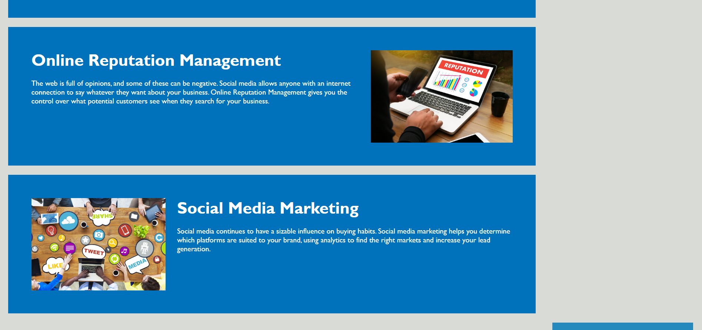
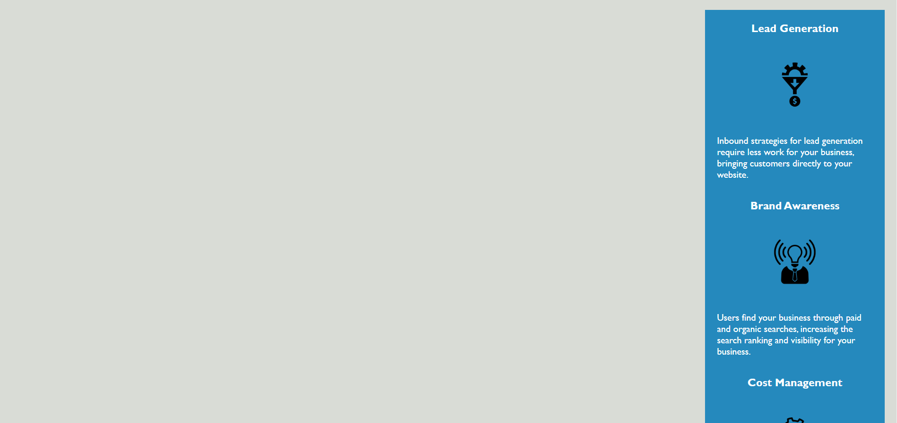
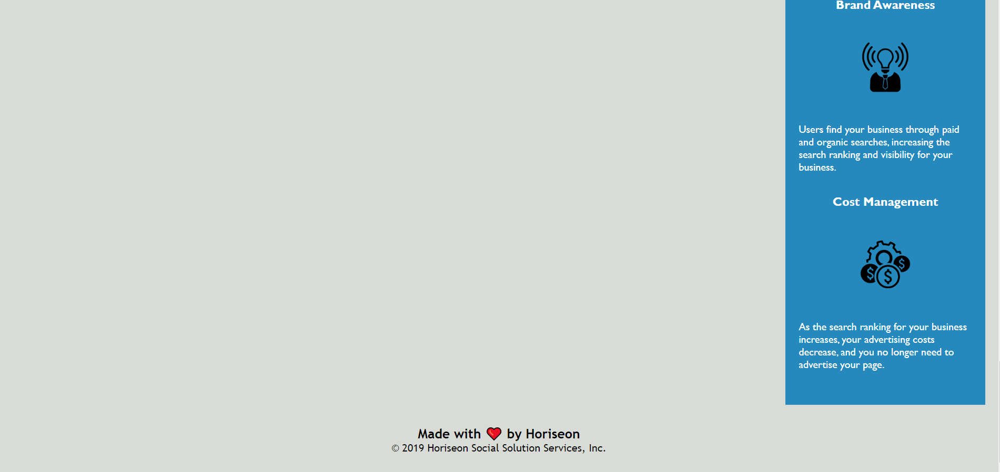

# <Your-Project-Title>

## Description

The motivation for this project was refactoring the code for the Services Offered and benefits page for the Horiseon company. We were motivated to optimize and consolidate code to increase efficiency and improve future workflow on the project. We solved the issue of code redundancy and missing links within the page, and learned to collaboratively work together with peers to effectively problem solve along with understanding how to make efficient code.

## Usage
Webpages such as this can be opened in the browser of your choice

## Credits

Starter code provided by Rutgers University Full Stack Flex Bootcamp

I'd also like to thank the knowledge and helpfulness of my classmates who quickly helped me get up to speed and understand the needs of the client and their collaborative spirit.

## License

MIT Open Software License

---